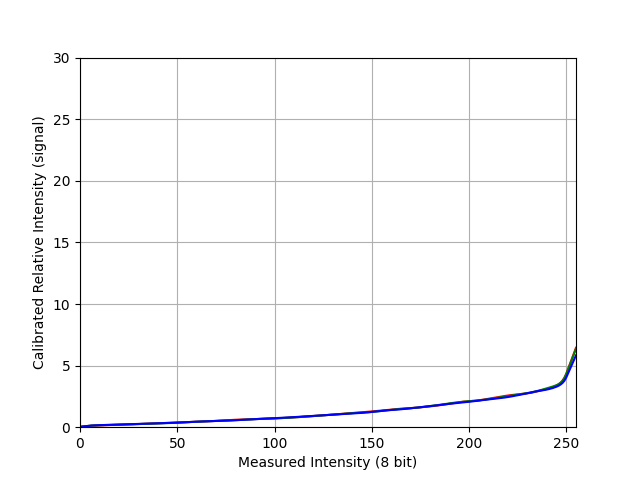

# DAVIDE - Dataset Synthesis
[](https://germanftv.github.io/ParallaxICB.github.io/)
[](https://arxiv.org/abs/2409.01274)


This project contains the source code to synthesize the Depth-Aware VIdeo DEblurring (DAVIDE) dataset from raw captured videos, which is introduced in the paper **"DAVIDE: Depth-Aware Video Deblurring" (ECCVW 2024)**.

<p align="center">
  
        <br>
        <em>Fig. 1. The DAVIDE blur synthesis pipeline</em>
</p>


 ### [Project Page](https://germanftv.github.io/DAVIDE.github.io/) | [arXiv](https://arxiv.org/abs/2409.01274) | [Benchmark Repository](https://github.com/germanftv/DAVIDE-Benckmark) | [Data Capture App](https://github.com/JussiKalliola/DAVIDE-app) | [Data Access Form](https://docs.google.com/forms/d/e/1FAIpQLSeQ2w4xsoIkzJ6kNseSiHkMaj303_tXRs2v23wqF3chfSF1FQ/viewform?usp=header)


## 📑 Contents

1. [Getting Started](#-getting-started)
2. [Download DAVIDE raw video captures](#-download-davide-raw-video-captures)
2. [Dataset Synthesis Pipeline](#-dataset-synthesis-pipeline)
3. [Camera Response Function](#-camera-response-function)
4. [Other Resources](#-other-resources)
5. [Citation](#-citation)

## 🚀 Getting started
### Requirements:

Ensure the following dependencies are installed and available:

1. **Conda**: Required for managing the project's environments.
2. **CUDA-enabled GPU**: Necessary for running GPU-accelerated tasks such as video interpolation, blur synthesis, and monocular depth estimation.
3. **FFmpeg**: Required for handling video processing tasks. Make sure it is installed and available in your system's PATH.
> **Note:** Ensure your system meets the following requirements before proceeding:
> - **CUDA Version**: The minimum supported version is 11.0, which is required by the project's dependencies.
> - **FFmpeg Configuration**: To execute step 6 (Generate video samples, optional), ensure that FFmpeg includes support for the `drawtext` filter. If necessary, you can compile `ffmpeg` with the [attached configuration](./assets/ffmpeg_config.sh).
> - **Large Data Storage**: If you aim to process all steps for the entire set of raw captures, ensure you have sufficient disk space available (~ 2TB).

### Installation:
1. Install XVFI submodule, which is used for video interpolation:
    ```bash
    git submodule update --init --recursive
    ```
2. Install conda environments:

    * **DAVIDE-DP**: Used for data processing in general (steps 1,2,3,4,5,6,8).
        ```bash
        conda env create -n DAVIDE-DP -f environments/dp_env.yml
        ```
    * **DAVIDE-MONO**: Used for additional monocular depth data (step 7).
        ```bash
        conda env create -n DAVIDE-MONO -f environments/mono_env.yml
        ```
3. Configure the data processing pipeline:
    ```bash
    bash scripts/setup_pipeline.sh /path_to/DATA_WORKSPACE --init_db
    ```
    This script performs the following tasks:
    - Installs our Python package into each environment.
    - Sets the `DATA_WORKSPACE` environment variable to the specified path.
    - Initializes the data processing logger. Default logger path is set [here](./davide_dp/configs/config.yaml#L40).

    The default [configuration file](./davide_dp/configs/config.yaml) uses the `DATA_WORKSPACE` environment variable to define the directories for the generated data.
4. Download the pretrained weights for XVFI. Refer to step 4 in the installation instructions provided in the [XVFI README](./davide_dp/XVFI/README.md).

## 📥 Download DAVIDE raw video captures:
Download raw video captures with the following script:

```bash
bash ./data/download_raw_captures.sh <username> <password> [--clean]
```
> **Notes:**
> - To access the raw video captures, please complete the [request form](https://docs.google.com/forms/d/e/1FAIpQLSeQ2w4xsoIkzJ6kNseSiHkMaj303_tXRs2v23wqF3chfSF1FQ/viewform?usp=header). Once submitted, you will receive an email with the credentials required to download the files.
> - If you already have the credentials, replace `<username>` and `<password>` with the provided details. Use the optional `--clean` flag to remove any temporary files after the download is complete.

## 🧪 Dataset Synthesis Pipeline

The dataset processing steps are executed sequentially for each of the 93 synchronized raw captures. Each step follows a consistent command-line interface:

```bash
bash scripts/run_0X_YY.sh <CLIP_ID> [--config <CONFIG_FILE>]
```

- `CLIP_ID`: The index of the recording to process (ranges from 0 to 92).
- `CONFIG_FILE` (optional): The path to a custom configuration file. If not provided, the default configuration file [`./davide_dp/configs/config.yaml`](./davide_dp/configs/config.yaml) is used.

Below is an example of the data processing steps for the first video clip (`CLIP_ID=0`):

1. **RGB Extraction**:
    ```bash
    conda activate DAVIDE-DP
    bash scripts/run_01_extract_rgb.sh 0
    ```
2. **RGB video interpolation**:
    ```bash
    conda activate DAVIDE-DP
    bash scripts/run_02_VFI.sh 0
    ```
3. **Blur synthesis**:
    ```bash
    conda activate DAVIDE-DP
    bash scripts/run_03_rgb_blur.sh 0
    ```
4. **Export real-captured depth**:
    ```bash
    conda activate DAVIDE-DP
    bash scripts/run_04_depth.sh 0
    ```
5. **Export camera data**:
    ```bash
    conda activate DAVIDE-DP
    bash scripts/run_05_camera_data.sh 0
    ```
6. **Generate video samples**:
    ```bash
    conda activate DAVIDE-DP
    bash scripts/run_06_sample-videos.sh 0
    ```

    > **Note:**  This step was intended for preliminary examination purposes. You may skip it if not interested in the video samples.
7. **Monocular depth estimation**:
    ```bash
    conda activate DAVIDE-MONO
    bash scripts/run_07_mono_depth.sh 0
    ```
    > **Note:**  This step computes additional monocular depth estimates from RGB frames. You may skip it this step if you do not plan to run experiments with these depth estimates.
8. **Export annotated data**:
    ```bash
    conda activate DAVIDE-DP
    bash scripts/run_08_data_selection.sh 0 [--mono_depth]
    ```
    > **Note:**  Include the `--mono_depth` if you also want to export the monocular depth estimates from step 7.

Alternatively, we provide SLURM scripts to generate the DAVIDE dataset for all the videos under the folder [`./scripts/slurm/`](./scripts/slurm/).

## 📈 Camera Response Function
<p align="center">
  
        <br>
        <em>Fig. 2. Estimated Camera Response Function (CRF). </em>  
</p>

For blur synthesis, we estimated the Camera Response Function (CRF) of our recording device. The pre-computed CRF can be found [here](./crf_calibration/crf_room02.pt). If you wish to calibrate the CRF for your own device, follow these steps:

1. Secure the device on a tripod and position it to capture a static scene with High Dynamic Range (HDR).
2. Capture multiple images of the static scene using varying exposure times (exposure bracketing).
3. Save the images in PNG format within a folder and sort them. Additionally, create a text file listing the exposure times (one per line) corresponding to the sorted images. Check the files in [`crf_calibration/room02`](./crf_calibration/room02/) for reference.
4. Run the [CRF estimation script](./davide_dp/crf_estimation.py). For example, [our CRF](./crf_calibration/crf_room02.pt) was generated using the following command:

    ```bash
    python davide_dp/crf_estimation.py \
        -i ./crf_calibration/room02/ \
        -e ./crf_calibration/room02/exposures.txt \
        -f crf_room02 \
        -s ./crf_calibration
    ```

For more details about the CRF calibration process, please refer to Appendix A.1 of our [paper](https://arxiv.org/abs/2409.01274).

## 🔗 Other Resources

1. [**Benchmark Repository**](https://github.com/germanftv/DAVIDE-Benckmark): Contains the source code for benchmarking deep video deblurring methods on the DAVIDE dataset.

2. [**Data Capture App**](https://github.com/JussiKalliola/DAVIDE-app): Provides the source code for the iOS application develped to capture synchronized RGB-D videos on iPhone devices.

3. [**Data Access Form**](https://docs.google.com/forms/d/e/1FAIpQLSeQ2w4xsoIkzJ6kNseSiHkMaj303_tXRs2v23wqF3chfSF1FQ/viewform?usp=header): Submit this form to request access to the released DAVIDE dataset and related resources.

## 📚 Citation
If you find our work useful in your research, please cite:

    @article{torres2024davide,
        title={DAVIDE: Depth-Aware Video Deblurring},
        author={Torres, German F and Kalliola, Jussi and Tripathy, Soumya and Acar, Erman and K{\"a}m{\"a}r{\"a}inen, Joni-Kristian},
        journal={arXiv preprint arXiv:2409.01274},
        year={2024}
        }

## 📝 License and Acknowledgements

This project is released under the [MIT license](LICENSE.txt). A big thanks to the original contributors of [XVFI](https://github.com/JihyongOh/XVFI).